# vCommander

vCommander is a comprehensive GUI application for managing Verkada organizations. It provides an intuitive interface for decommissioning assets, importing users from guest visits, and managing organization resources through both Verkada's public API and internal endpoints.

> [!CAUTION]  
> **The Decommission tool is destructive**. It is designed to **delete** users, devices, sites, and configurations. Once the deletion process begins, it cannot be undone. Always review the inventory carefully before confirming deletion. **Do not run this tool in a production environment** unless you intend to wipe the organization completely.

## Preview

### Login Page

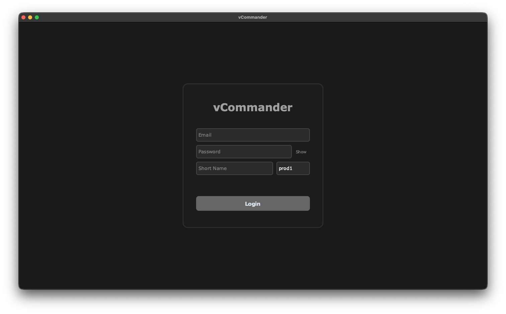

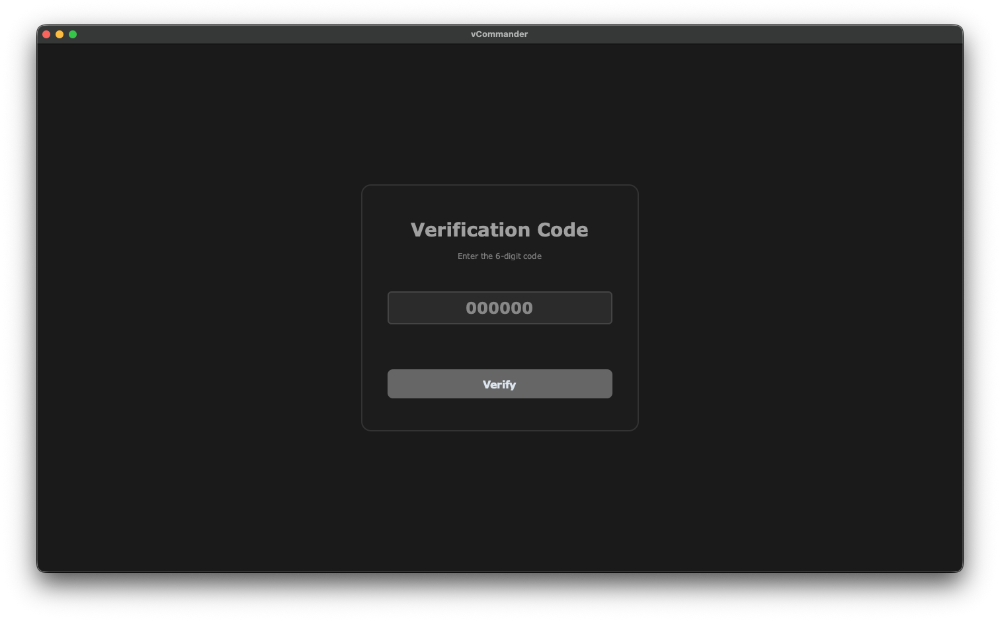

### Decommission Tool Flow

#### Starting Inventory Scan

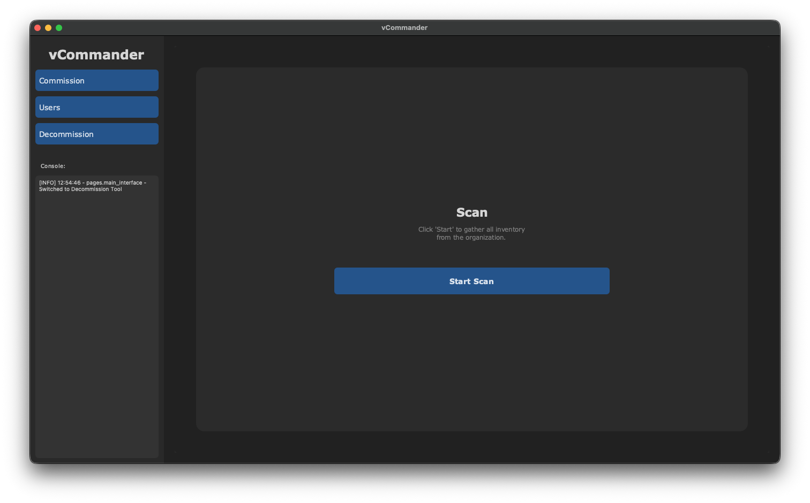

#### Scanning Cameras

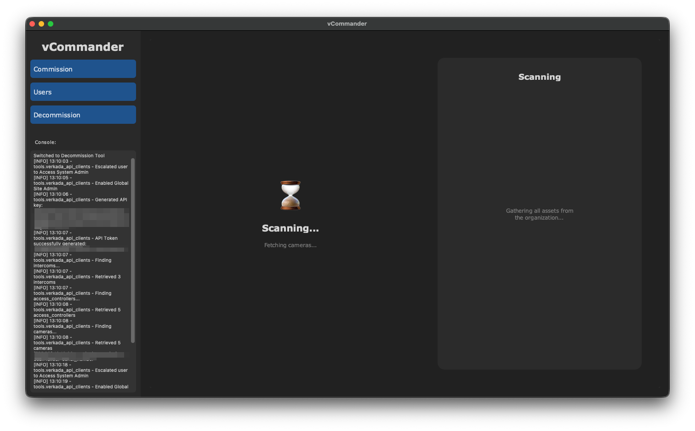

#### Review Assets and Export List


#### Deleting Assets

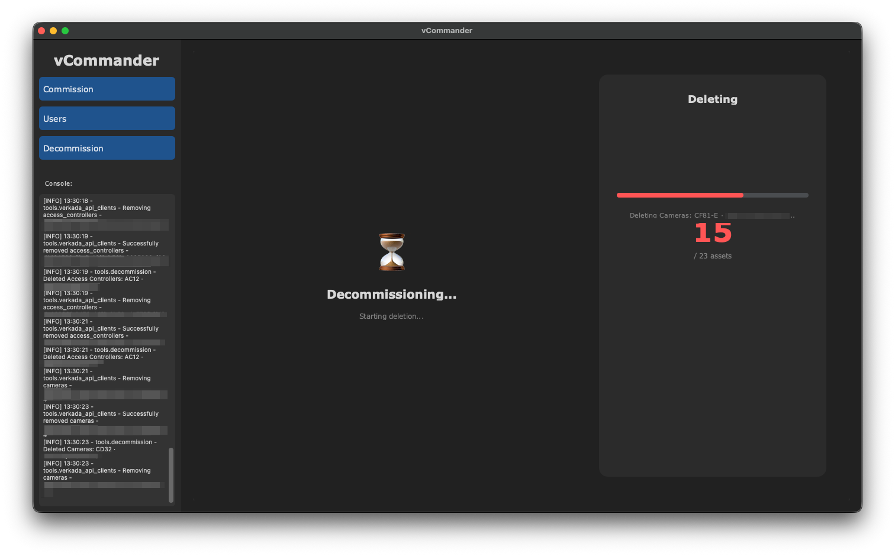

#### Deletion Completion

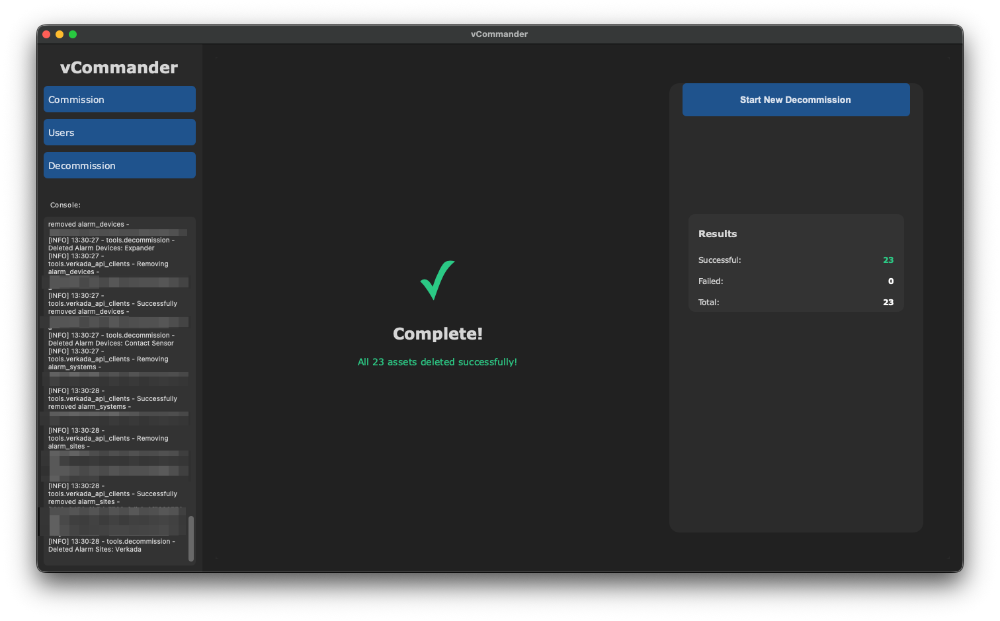

### User Add Tool Flow

#### Accessing Import Organization using API

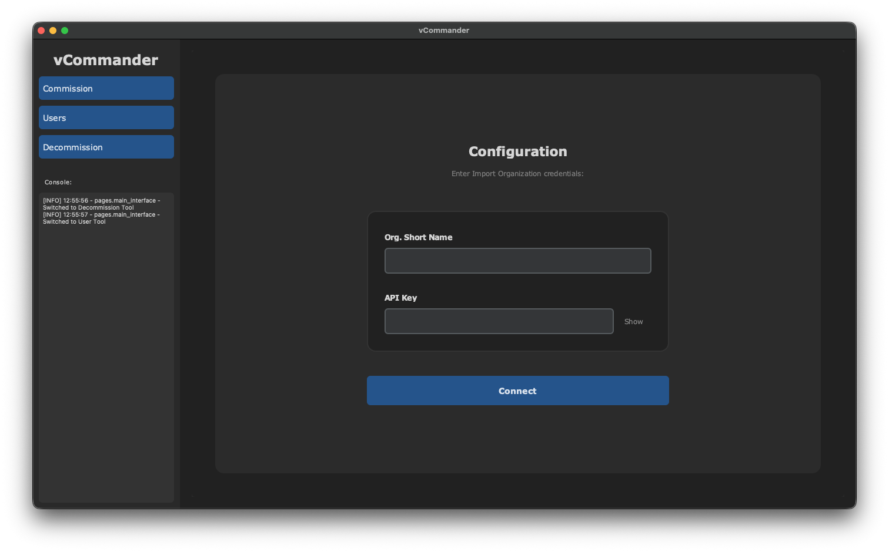

#### Selecting Site to Import

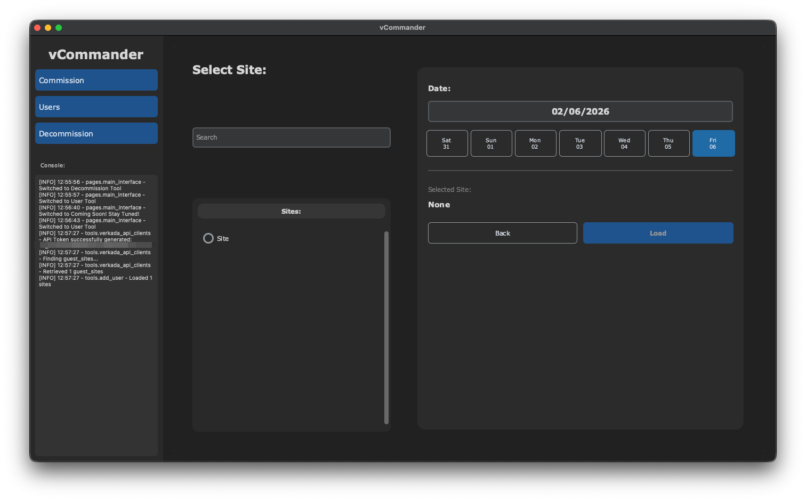

#### Reviewing Users

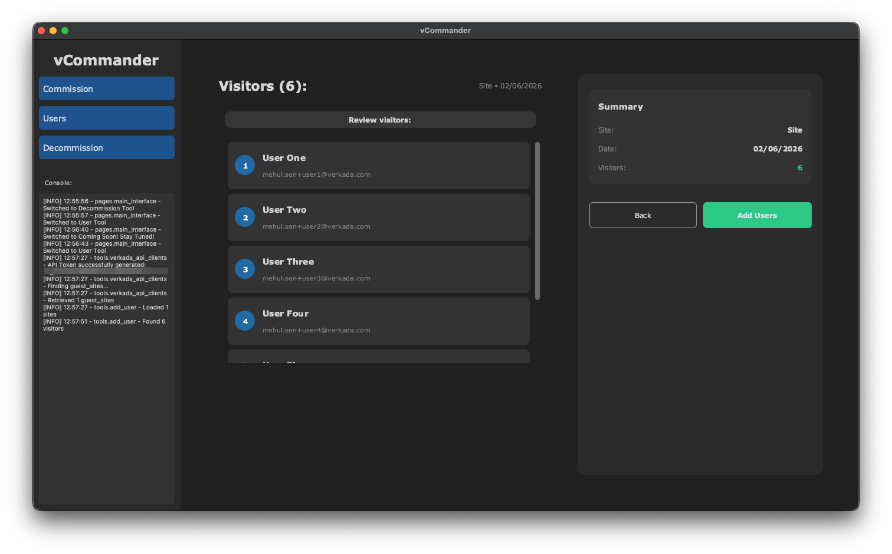

#### Adding Users to Organization

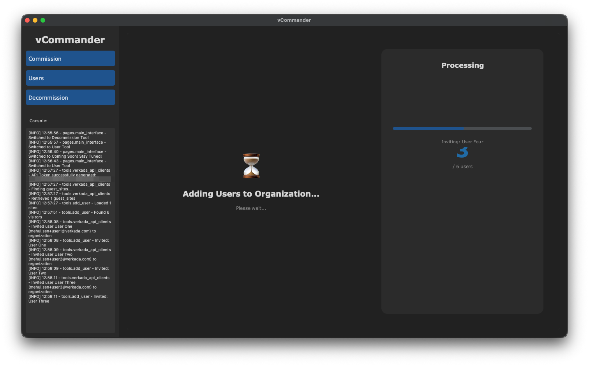

#### User Add Completion

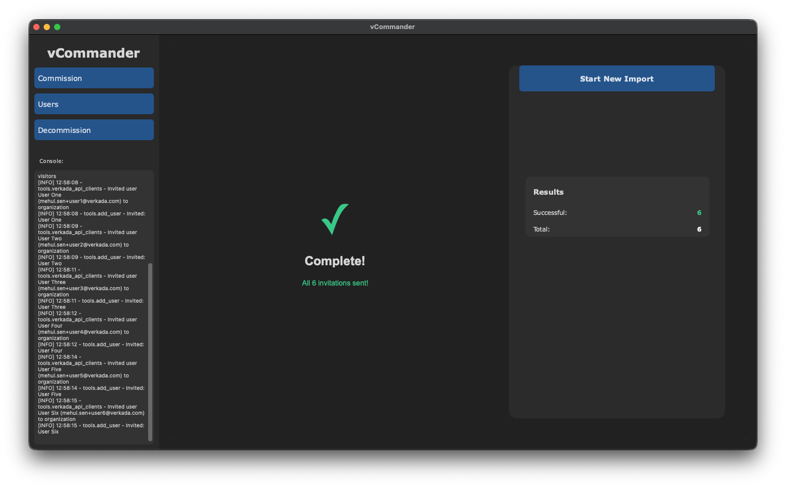

## Key Features

### Multi-Tool Dashboard
- **Decommission Tool**: Complete asset inventory and deletion workflow
- **Add User Tool**: Import guest visitors from any Verkada organization as users in your organization
- **Commission Tool**: *(Coming Soon)* Add and configure new devices

### Authentication & Security
- **Secure Login**: Email/password authentication with optional MFA/2FA support
- **Session Management**: Maintains authenticated session across all tools
- **Environment Variable Support**: Auto-fill credentials from `.env` file for development

### Decommission Tool
- **Hybrid API Architecture**: Combines Internal Client (browser emulation) with External Client (Public API) for comprehensive coverage
- **Smart Inventory**: Automatically deduplicates embedded devices (e.g., cameras in Intercoms)
- **Detailed Reporting**: Generates formatted reports with export to text files
- **Dependency-Aware Deletion**: Deletes assets in strict order to prevent API errors
- **Selective Deletion**: Choose specific assets to delete rather than all-or-nothing

### Add User Tool
- **Cross-Organization Import**: Connect to any Verkada organization using API credentials
- **Guest Visit Import**: Import visitors from Guest sites as organization users
- **Date Range Selection**: Select specific dates to import visitors from
- **Bulk Invitation**: Send org admin invitations to multiple users at once

### Real-Time Console
- **Live Logging**: View application logs in real-time within the GUI
- **Progress Tracking**: Visual progress indicators for long-running operations
- **Status Updates**: Current operation displayed during scans and deletions

## Supported Assets (Decommission)

- Cameras
- Access Controllers
- Environmental Sensors
- Intercoms
- Desk Stations
- Mailroom Sites
- Guest Sites
- Alarm Sites & Alarm Systems
- Alarm Devices
- Users (Admins/Members)

## Prerequisites

- **Python 3.10+**
- **Network Access:** The machine must have access to `*.command.verkada.com` and `api.verkada.com`
- **Display:** GUI requires a display (Windows, macOS, or Linux with X11/Wayland)

## Dependencies

```
requests>=2.28.0
urllib3>=1.26.0
customtkinter>=5.0.0
python-dotenv>=0.19.0
```

## Installation

1. **Clone the repository:**

```bash
git clone https://github.com/not-mehul/vCommander
cd vCommander
```

2. **Set up a Virtual Environment (Recommended):**

```bash
python -m venv .venv
source .venv/bin/activate  # On Windows use: .venv\Scripts\activate
```

3. **Install Dependencies:**

```bash
pip install -r requirements.txt
```

## Configuration

### Environment Variables (Optional)

Create a `.env` file in the project root to auto-fill login credentials:

```bash
# Required for login auto-fill
ADMIN_EMAIL=admin@example.com
ADMIN_PASSWORD=your_password
ORG_SHORT_NAME=your-org
SHARD=prod1

# Optional - for Add User tool cross-org import
LEGAL_API_KEY=your_api_key
LEGAL_ORG_SHORT_NAME=source-org
```

| Variable | Required | Description | Default |
|----------|----------|-------------|---------|
| `ADMIN_EMAIL` | ❌ | Organization admin email (for auto-fill) | - |
| `ADMIN_PASSWORD` | ❌ | Admin password (for auto-fill) | - |
| `ORG_SHORT_NAME` | ❌ | Organization short name/subdomain | - |
| `SHARD` | ❌ | Backend shard | `prod1` |
| `LEGAL_API_KEY` | ❌ | API key for Add User tool source org | - |
| `LEGAL_ORG_SHORT_NAME` | ❌ | Source org short name for Add User tool | - |

> **Note:** Environment variables are optional. All credentials can be entered manually in the GUI.

## Usage

### Starting the Application

```bash
cd gui
python main.py
```

### Login

1. Enter your Verkada credentials:
   - **Email**: Your admin email address
   - **Password**: Your password
   - **Short Name**: Organization subdomain (e.g., `myorg` from `myorg.command.verkada.com`)
   - **Shard**: Backend shard (usually `prod1`)

2. Click **Login**

3. If MFA is enabled, enter the 6-digit code from your authenticator app

### Decommission Tool

1. **Scan**: Click "Start Scan" to inventory all assets
2. **Review**: Review the discovered assets and category counts
3. **Select**: Click "Select Assets" to choose which items to delete
   - Use checkboxes to select individual assets
   - Use "Select All" to select everything
4. **Decommission**: Click "Decommission" and confirm
5. **Monitor**: Watch progress as assets are deleted
6. **Results**: View summary of successful and failed deletions

**Saving Reports**: Click "Save TXT Report" at any time after scanning to export an inventory report.

### Add User Tool

1. **Configure**: Enter API credentials for the source organization (where guest visits exist)
2. **Select Site**: Choose a site from the list and select a date
3. **Load**: Click "Load" to fetch visitors for that date
4. **Review**: Review the visitor list
5. **Add Users**: Click "Add Users" to invite all visitors as org admins

## Architecture Overview

```
vCommander/
├── gui/
│   ├── main.py                    # Application entry point
│   ├── pages/
│   │   ├── login_page.py          # Login screen
│   │   ├── two_fa_page.py         # MFA verification screen
│   │   └── main_interface.py      # Main dashboard with sidebar
│   └── tools/
│       ├── verkada_api_clients.py # API client classes
│       ├── verkada_reporting.py   # Report generation
│       ├── verkada_utilities.py   # Helper functions
│       ├── decommission.py        # Decommission tool UI
│       ├── add_user.py            # Add User tool UI
│       └── commission.py          # Commission tool (placeholder)
├── requirements.txt
└── README.md
```

### API Clients

**VerkadaInternalAPIClient**
- Mimics browser behavior using session cookies and CSRF tokens
- Accesses internal/private APIs for comprehensive device management
- Handles login, MFA verification, and privilege escalation
- Dynamically generates temporary API keys

**VerkadaExternalAPIClient**
- Uses standard public API endpoints
- Automatic token generation and retry logic
- Used for user management and guest site operations

### Deletion Order

To prevent dependency errors, the Decommission tool deletes assets in this order:

1. **Users** (Prevents interference)
2. **Sensors**
3. **Intercoms**
4. **Desk Stations**
5. **Mailroom Sites**
6. **Guest Sites**
7. **Access Controllers**
8. **Cameras**
9. **Alarm Devices**
10. **Alarm Sites** (includes Alarm Systems)

## Troubleshooting

### Login Issues
- Verify your organization short name is correct (just the subdomain, not the full URL)
- Check that you're using the correct shard (usually `prod1`)
- If MFA fails, ensure you're entering the code quickly (codes expire)

### Scan Failures
- Ensure you have Organization Admin privileges
- Check network connectivity to `*.command.verkada.com`
- Review the console for specific error messages

### API Key Limit
If you see "Exceeded 10 API Keys Limit":
- Delete old API keys from your Verkada dashboard
- API keys generated by this tool expire after 1 hour automatically

## Security Considerations

- Credentials are not stored persistently (unless using `.env` file)
- API keys are temporary (1-hour expiration)
- MFA is supported and recommended
- The tool requires Organization Admin privileges
- All deletions are permanent and cannot be undone

## Disclaimer

> [!IMPORTANT]  
> This software is an unofficial tool and is **not supported by Verkada**. It uses internal APIs which may change without notice. Use at your own risk. Always test in a non-production environment first. The authors are not responsible for any data loss or damage caused by using this tool.

## License

[MIT License](LICENSE)
